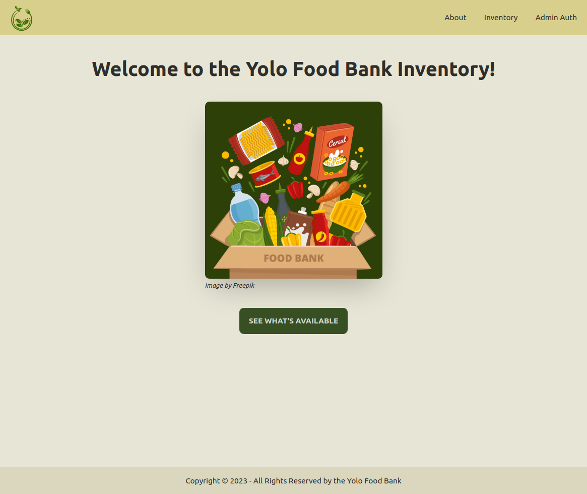
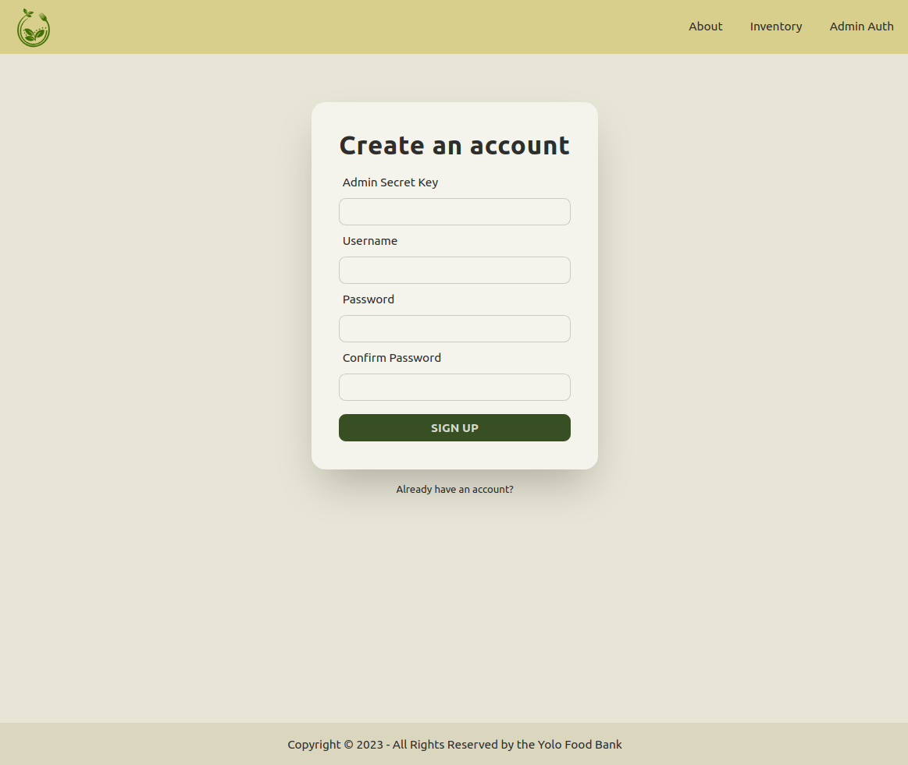
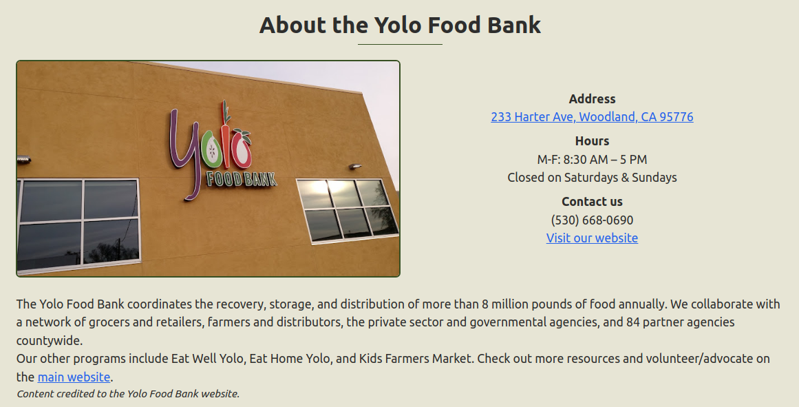
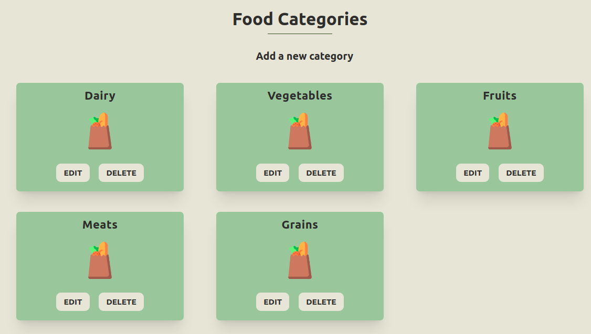
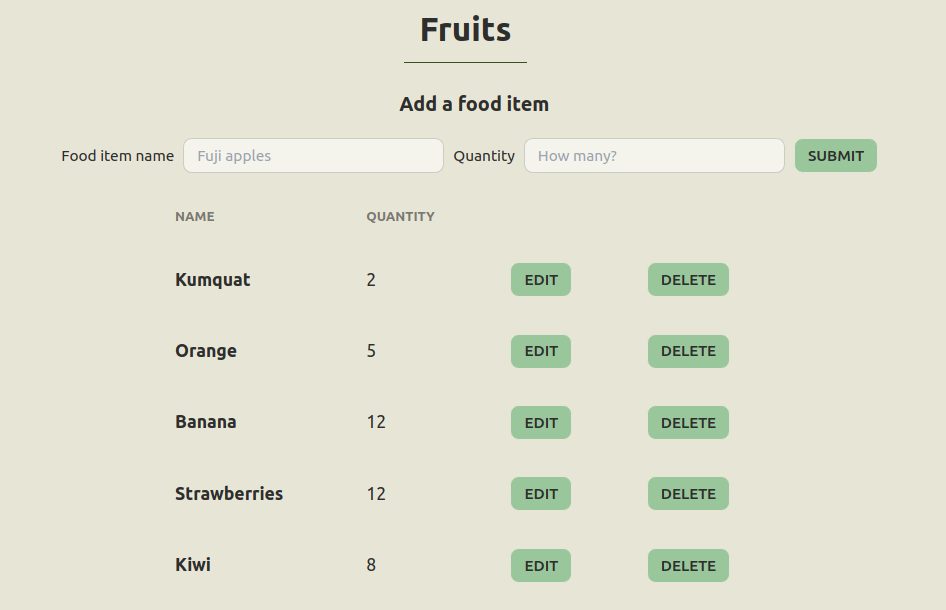
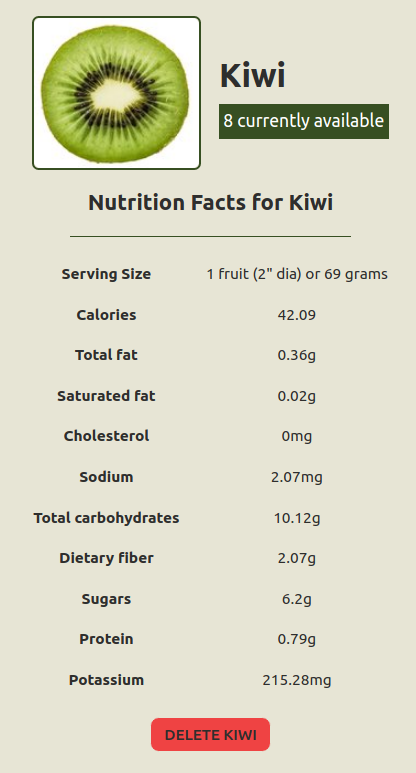

<h1 align="center"><a href="https://guileless-starlight-786809.netlify.app/">Food Bank Inventory App</a></h1>

<!-- TABLE OF CONTENTS -->

  
Table of Contents

  <ol>
    <li><a href="#background">Background</a></li>
    <li><a href="#screenshots">Screenshots</a></li>
    <li><a href="#technologies-used">Technologies Used</li>
    <li><a href="#getting-started">Getting Started</a></li>
    <li><a href="#next-steps">Next Steps</a></li>
    <li><a href="#resources">Resources</a></li>
  </ol>

## Background

The food bank inventory app is for people who want to see the current inventory of a food bank. Guest users can click on available food items to see nutritional information. Admin users can manage the inventory by making changes to the available food categories and items. Admin users can only be created with the correct secret key.

Inspired by the Yolo Food Bank.

## Screenshots

## Technologies Used

- [React](https://react.dev/)
- [Node.js](https://nodejs.org/en) (with [Express](https://expressjs.com/))
- [MongoDB](https://www.mongodb.com/) (with [Mongoose](https://mongoosejs.com/))
- [Tailwind CSS](https://tailwindcss.com/) (with [DaisyUI](https://daisyui.com/))

## Getting Started

- [Website](https://guileless-starlight-786809.netlify.app/)
- [Trello board](https://trello.com/b/og1a6WsW/food-bank-inventory)

## Next Steps

- The ability for admins to scan items for automatic inventory updates
- The ability for guest users to search for specific food items
- The ability for guest users to select a food bank at a different location and see its inventory
- The ability for guest users to place an order for pickup

## Resources

- [Nutrionix API V2](https://trackapi.nutritionix.com/docs/#/)
- [Realtime Colors](https://realtimecolors.com/?colors=000000-ffffff-374f22-99c79b-c0c18f)
- [Favicon (food icons created by Freepik - Flaticon)](https://www.flaticon.com/free-icons/food)
- [Grocery bag png in category card](https://www.flaticon.com/free-icons/goods)
- StackOverflow answers credited in relevant code blocks (re: image loading)

Feel free to submit a pull request if you would like to suggest any changes!
